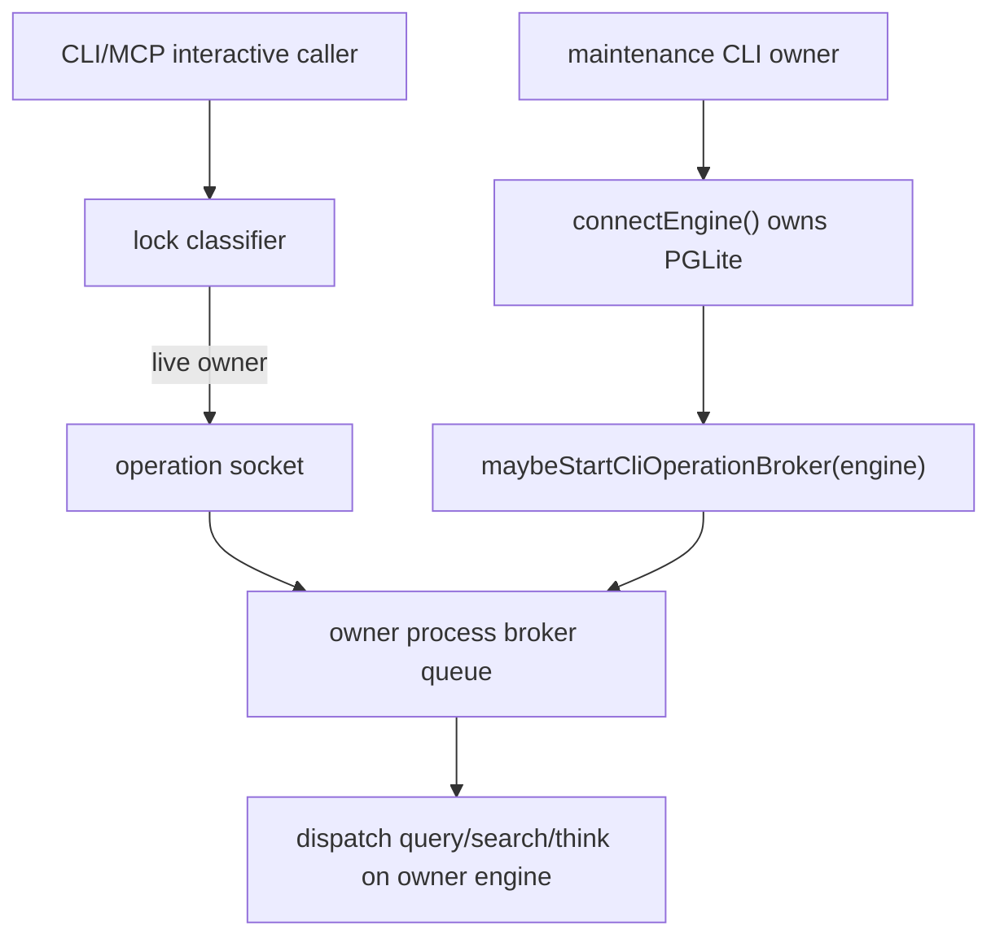

# Technical Design: PGLite Priority Scheduler

## Status

Complete.

## Requirement

- Source: `requirements/003-pglite-priority-scheduler/requirements.md`
- Research: `requirements/003-pglite-priority-scheduler/research.md`
- Date: 2026-06-20

## Goals

- Preserve direct CLI behavior when no PGLite owner exists.
- Let a live maintenance owner serve interactive `query`, `search`, and `think` through the existing local operation broker.
- Prevent second `sync`, `embed`, or `extract` callers from waiting on the PGLite file lock and surfacing raw lock timeout text.
- Keep priority claims bounded to queue/checkpoint boundaries.

## Non-Goals

- Do not add `sync`, `embed`, or `extract` as brokered operations.
- Do not add network forwarding, raw SQL forwarding, or a mandatory daemon.
- Do not interrupt running DB transactions or maintenance command bodies.
- Do not change public command syntax.

## Current Architecture



Important current facts:

- `startPgliteOperationIpcServer()` owns the queue and already sorts `interactive` over `maintenance`.
- `dispatchBrokeredOperation()` only executes `query`, `search`, and `think`.
- `handleCliOnly()` starts the broker after a DB-bound command successfully connects.
- `sync`, `embed`, and `extract` are DB-bound CLI-only commands after their help/no-DB bypasses.

## Proposed Changes

### 1. Add a maintenance command set

Add a local constant near the existing broker constants in `src/cli.ts`:

```ts
const PGLITE_MAINTENANCE_COMMANDS = new Set(['sync', 'embed', 'extract']);
```

Only these commands are in scope for requirement 003.

### 2. Add `maybeDeferPgliteMaintenanceCommand()`

Add a pre-connect helper in `src/cli.ts`:

```ts
async function maybeDeferPgliteMaintenanceCommand(command: string): Promise<boolean>
```

Behavior:

- Return `false` for non-maintenance commands.
- Return `false` for non-PGLite config or missing `database_path`.
- Inspect `classifyPgliteLock(database_path)`.
- `absent`: try `tryAcquireOperationStartup(database_path)` and allow direct open when acquired, mirroring interactive first-owner election.
- `absent` but startup election is already held: emit deterministic `owner_starting` fallback before direct open. This covers the owner-starting/no-socket window.
- `dead_or_stale_recoverable`: return `false` so the existing PGLite lock acquisition path can recover stale state.
- `live`: emit `PGLite owner broker error [maintenance_deferred]: ...` and set CLI exit verdict to `1`, then return `true`.
- `corrupt_recoverable` or `unknown`: emit `lock_safety_blocked` and return `true`.

The live fallback message should be deterministic and avoid promising that maintenance was queued. Suggested copy:

```text
PGLite owner broker error [maintenance_deferred]: Another PGLite owner is live; gbrain <command> was not started. Run it again after the owner exits. Interactive query/search/think calls can use the owner broker while the owner is live.
```

### 3. Call the helper before `connectEngine()`

In `handleCliOnly()` after no-DB/help bypasses and before watchdog setup plus `connectEngine()`:

```ts
if (await maybeDeferPgliteMaintenanceCommand(command)) return;
```

Placement matters:

- after `sync --help` so help remains no-DB
- before `sync` watchdog and `connectEngine()` so live-lock maintenance contention exits quickly
- before command module imports where possible to keep fallback uniform

### 4. Preserve owner broker startup

Do not change:

```ts
const engine = await connectEngine();
const brokerServer = command === 'serve' ? null : await maybeStartCliOperationBroker(engine);
```

This is what makes a successful maintenance owner expose the existing broker while it runs.

### 5. Keep IPC priority unchanged

Do not change `OperationIpcOperation` for this requirement. The existing `class: 'maintenance'` queue test is sufficient for generic scheduler correctness, and the real command matrix is satisfied through command-level deferral evidence.

## Failure Semantics

| State | Command | Behavior |
| --- | --- | --- |
| No PGLite owner | `sync`/`embed`/`extract` | Existing direct-open behavior |
| No PGLite owner, startup election held | `sync`/`embed`/`extract` | Deterministic `owner_starting`, no direct open |
| Dead/stale owner lock | `sync`/`embed`/`extract` | Existing stale recovery path |
| Live PGLite owner | `sync`/`embed`/`extract` | Deterministic `maintenance_deferred`, no direct open |
| Corrupt/unknown lock | `sync`/`embed`/`extract` | Deterministic `lock_safety_blocked`, no direct open |
| Live PGLite owner | `query`/`search`/`think` | Existing owner broker forwarding |

## Acceptance Criteria Mapping

| AC | Design coverage |
| --- | --- |
| AC1 | Existing `handleCliOnly()` owner path starts broker after `connectEngine()`; tests should prove interactive callers proxy while a live owner exists. |
| AC2 | Existing IPC priority queue test proves interactive beats maintenance-class queued work. |
| AC3 | Design explicitly limits priority to queue boundary; no transaction interruption. |
| AC4 | New maintenance deferral guard prevents second maintenance caller from direct-opening under live owner. |
| AC5 | Real command tests cover `sync`, `embed`, and `extract` with `deferred_safe_fallback`. |
| AC6 | No new flags or command syntax. |
| AC7 | Reuses local filesystem IPC; no network/raw SQL forwarding. |
| AC8 | Rerun requirement 002 related suite. |

## Test Plan

### Unit / IPC

- Keep `test/pglite-operation-ipc.test.ts` priority test green:
  - slow maintenance-class item starts first
  - queued interactive item beats queued maintenance-class item after first item completes

### CLI command-level tests

Add tests to `test/cli-pglite-operation-broker.test.ts`:

- `sync` under live lock returns `maintenance_deferred`
- `embed` under live lock returns `maintenance_deferred`
- `extract` under live lock returns `maintenance_deferred`
- one maintenance command under held startup election returns `owner_starting`
- one maintenance command under corrupt lock returns `lock_safety_blocked`
- no-owner command-level smoke evidence proves public direct-open behavior remains reachable

For each:

- write a live PGLite lock using the existing fixture helper
- run the real CLI dispatch command with safe arguments
- assert the command exits quickly
- assert stderr includes the expected stable status
- assert exit status is non-zero for fallback states
- assert stderr does not include `Timed out waiting for PGLite lock` or `Could not acquire PGLite lock`
- assert fallback stderr does not imply the maintenance command was queued, completed, or successfully run

Suggested arguments:

- `sync --no-pull --no-embed --no-extract --yes`
- `embed --stale --dry-run`
- `extract --stale --dry-run`

For no-owner smoke evidence, use inexpensive syntax that reaches the real command's direct path without depending on external providers where possible. If a command exits with its normal validation or credential error after direct open, that is acceptable evidence as long as it does not return broker fallback or PGLite lock timeout.

### Regression

Run:

```bash
bun test test/pglite-lock.test.ts test/pglite-operation-ipc.test.ts test/cli-pglite-operation-broker.test.ts test/serve-stdio-lifecycle.test.ts test/cli-search-dispatch.test.ts test/context/resolve-ipc.test.ts test/takes-mcp-allowlist.serial.test.ts test/mcp-stdio-source-scope.test.ts --timeout 60000
bun run typecheck
```

## Per-Command Coverage Matrix Target

| Command | Target classification | Evidence |
| --- | --- | --- |
| `sync` | `deferred_safe_fallback` | Real CLI dispatch under live owner lock returns `maintenance_deferred` before direct PGLite open. |
| `embed` | `deferred_safe_fallback` | Real CLI dispatch under live owner lock returns `maintenance_deferred` before direct PGLite open. |
| `extract` | `deferred_safe_fallback` | Real CLI dispatch under live owner lock returns `maintenance_deferred` before direct PGLite open. |

## Risks And Mitigations

- Risk: fallback wording implies the command was queued.
  - Mitigation: use `maintenance_deferred`, not `maintenance_queued`.
- Risk: startup election is held before the owner socket is bound.
  - Mitigation: return deterministic `owner_starting` instead of direct-opening.
- Risk: guard blocks stale recovery.
  - Mitigation: allow `dead_or_stale_recoverable` to proceed through existing lock acquisition.
- Risk: help commands start returning lock errors.
  - Mitigation: place guard after help/no-DB bypasses.
- Risk: startup race between two no-owner commands.
  - Mitigation: reuse `tryAcquireOperationStartup()` for absent lock to preserve first-owner election behavior.

## Open Questions

None blocking.
